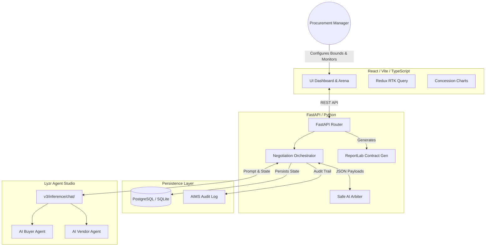

#  LyzrNegotiate: Autonomous B2B Negotiation Platform

[](https://fastapi.tiangolo.com/)
[](https://reactjs.org/)
[](https://www.postgresql.org/)
[](#)

> **🏆 AI Quest: Beyond the Wrapper (PS 02) Submission**
> 
> * **Live Interactive Dashboard (Frontend):** [https://lyzer-negotiator-project.vercel.app](https://lyzer-negotiator-project.vercel.app)
> * **Live API & Swagger Docs (Backend):** [https://lyzer-negotiator-project.onrender.com](https://lyzer-negotiator-project.onrender.com)

LyzrNegotiate is a production-grade, multi-agent AI platform designed to automate B2B vendor and procurement negotiations. By leveraging **Lyzr Agent Studio**, the platform pits an autonomous AI Buyer against an autonomous AI Vendor to negotiate contract terms (Price, Delivery Days, and SLA Penalties) in real-time, completely eliminating the weeks of email ping-pong typically required for B2B contracting.

---

## 🎯 Uses of the Project

This platform is designed for enterprise procurement and supply-chain teams. Key use cases include:

1. **Procurement Automation:** Automatically haggle with software vendors, freelancers, or raw material suppliers to secure the best possible price without human intervention.
2. **Dynamic Vendor Quoting:** Allow clients to immediately negotiate with your company's AI sales agent, providing instant concessions and finalizing contracts 24/7.
3. **Safe AI Contracting:** Ensure that no AI agent ever agrees to a deal outside of strict financial limits, thanks to the mathematical guardrails enforced by the Safe AI Arbiter.
4. **Tamper-Proof Audit Trails:** Automatically log every AI decision, concession, and justification to a persistent database and the AIMS governance layer for compliance tracking.

---

## 🏗️ System Architecture

The application is decoupled into three primary layers: a React Single Page Application (SPA), a Python FastAPI orchestration backend, and the Lyzr Agent Studio inference layer.



---

## 🧩 Component Breakdown

### 1. The Frontend (React + Vite + TypeScript)
The frontend serves as the control center for human oversight. It is designed with TailwindCSS for a sleek, enterprise SaaS feel.

* **Setup Dashboard (HomePage.tsx):** Users define strict policy bounds (Max Budget, Min SLA, Max Delivery) before initializing a session.
* **Negotiation Arena (ArenaPage.tsx):** A real-time monitoring room. It visualizes the AI conversation, tracks the declining price curves via Recharts, and displays the mathematical boundaries holding the AI accountable.
* **History Dashboard (HistoryPage.tsx):** A centralized view of all past negotiations, allowing users to replay past sessions and download finalized PDF contracts instantly.

### 2. The Backend (FastAPI + SQLAlchemy)
The backend acts as the "referee" between the user, the database, and the AI agents.

* **The Orchestrator:** Manages the turn-based loop. It passes the current state of the negotiation to the AI, receives the counter-offer, and passes it to the Arbiter.
* **Safe AI Arbiter:** A deterministic, mathematical firewall. Before any AI bid is recorded, the Arbiter parses the JSON output and verifies it does not violate the user's hard limits (e.g., spending more than the max budget). If the AI hallucinates or breaks a rule, the Arbiter forces a retry.
* **Persistence:** Utilizes SQLAlchemy to support both local SQLite (for rapid development) and managed PostgreSQL (for production).
* **Stateless Contract Generation:** To completely bypass ephemeral filesystem data-loss (a common issue on cloud platforms like Render), the backend generates legally formatted PDF contracts entirely on-the-fly. It queries the PostgreSQL database for the final terms, renders the PDF directly into an in-memory byte stream (`io.BytesIO`) via ReportLab, and pipes it straight to the browser using a FastAPI `StreamingResponse`.

### 3. The AI Layer (Lyzr Agent Studio)
Instead of relying on basic LLM API wrappers, the platform connects directly to Lyzr Agent Studio (https://agent-prod.studio.lyzr.ai/v3/inference/chat/).

* **Personas:** The agents are configured in the Lyzr Studio UI with specific negotiation tactics (e.g., aggressive price anchoring vs. value-based selling).
* **Robust Parsing:** The backend utilizes defensive Pydantic parsing to handle the JSON payloads returned by the agents, protecting the system against minor LLM hallucinations.

---

## 🚀 Setup & Installation

### Prerequisites
* Node.js (v18+)
* Python (3.10+)
* Lyzr API Key & Agent IDs (from studio.lyzr.ai)

### Docker Setup (Recommended for Judges)
The easiest way to spin up the entire full-stack application locally is via Docker:

```bash
# 1. Copy the environment variables
cp .env.example .env

# 2. Build and run the containers
docker-compose up --build
```
The application will be available at `http://localhost:3000` (Frontend) and the API docs at `http://localhost:8000/docs`.

### Backend Setup (Manual)
```bash
cd backend
python -m venv venv
source venv/bin/activate  # (Windows: venv\Scripts\activate)
pip install -r requirements.txt

# Configure your environment variables
cp .env.example .env

# Run the server
uvicorn app.main:app --reload
```

### Frontend Setup
```bash
cd frontend
npm install

# Point the frontend to your local backend
echo "VITE_API_BASE_URL=http://localhost:8000" > .env

npm run dev
```

---

## ☁️ Deployment
This project is decoupled and optimized for modern PaaS (Platform as a Service) deployment.

* **Frontend:** Deployed seamlessly on Vercel or Netlify (configured via the included vercel.json for React Router support).
* **Backend:** Deployed on Render or Railway. The repository includes a render.yaml blueprint. We strongly recommend configuring Render's free PostgreSQL database and setting the DATABASE_URL environment variable to ensure persistent negotiation history.
